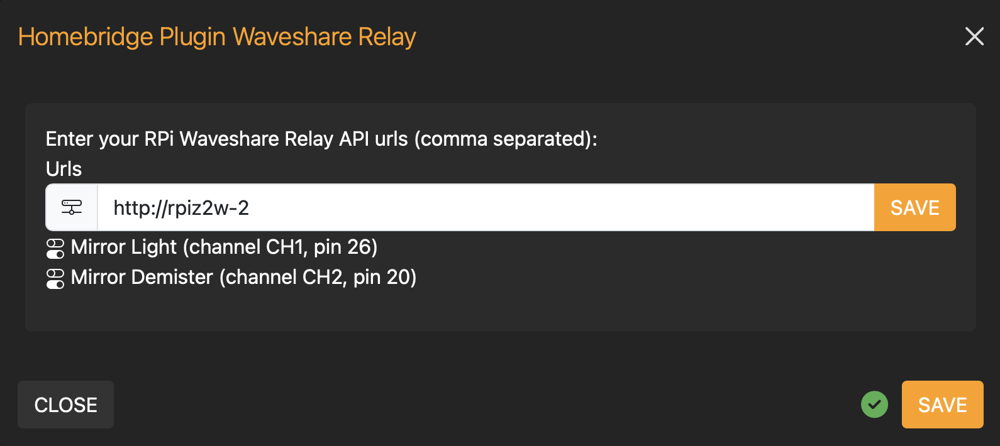
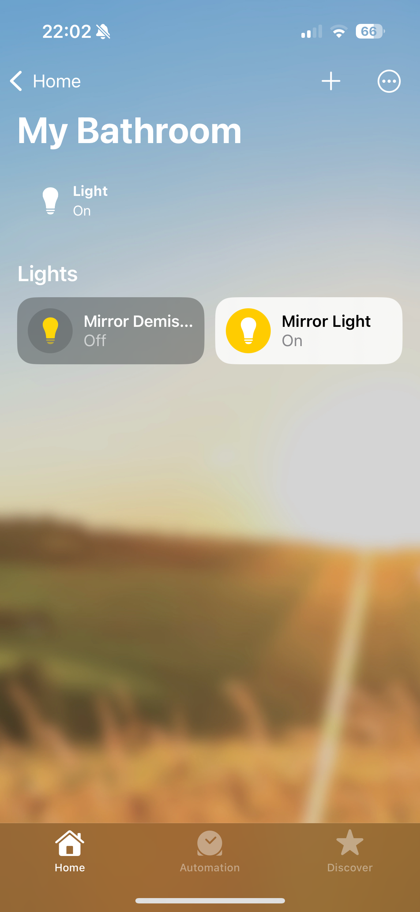
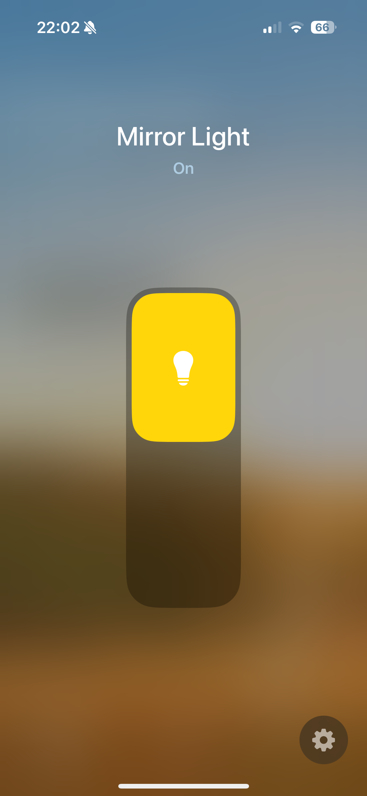

# homebridge-plugin-waveshare-relay

Homebridge plugin exposing Waveshare Raspberry Pi Relay Board as a series of switches.

## Using the plugin

You will need one or more Raspberry Pis with the Waveshare Relay board running [rpi-relay-hat-api](https://github.com/jondarrer/rpi-relay-hat-api). All the relays are retrieved from the boards, and are automatically created in the Home App.

You will also need a server running [Homebridge](https://homebridge.io).

### Installation

Install the plugin by searching for "Waveshare Relay Homebridge Plugin" through the Homebridge Plugins UI or manually by:

```sh
sudo npm -g i homebridge-plugin-waveshare-relay
```

Use the plugin Config UI X to specify all the board urls and all the associated individual relays will be added to Homebridge:

### Configure the plugin with your Waveshare relays



### Usage

Room View with Waveshare Relays | Waveshare Relay Main View
| :---------------------: | :-------------------: |
 | 

## Relay Control

Each relay on the board appears as a lightbulb in the Home app, and the relay can be turned on and off as if it were a lightbulb.

## Developing

### Clone and install dependencies

```sh
git clone git@github.com:jondarrer/homebridge-plugin-waveshare-relay
cd homebridge-plugin-waveshare-relay
yarn
```

### Testing

Run the tests with the usual command:

```sh
yarn test
```

Debug within VS Code by running the `npm run local-homebridge` task.

### Building and publishing

```sh
yarn build
npm version patch -m "%s"
git push && git push --tags
```

### Running Dockerised Homebridge for integration testing

NB. Requires `docker-compose`.

```sh
npm run containerised-homebridge
```

This will build the plugin and copy the necessary files to the appropriate places within container volume space (`./volumes/homebridge`). It will then start it, making it available at [http://localhost:8581](http://localhost:8581).

It is necessary to re-run this process on changes to the source code.

To stop the container, simply run `docker-compose down`.

<https://www.reddit.com/r/homebridge/comments/vusfib/homebridge_and_npm_node_locations_on_raspberry_pi/?rdt=65185>
